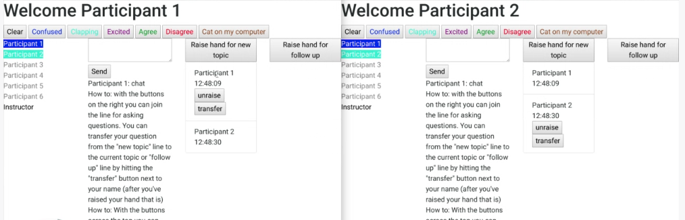

# synchronous-dashboard

A dashboard that can be used in meetings to allow participants to indicate emotions, chat, and raise hands without using video. It's google apps script based and will only work in a full G-suite application. [See my blog post about it here](https://arundquist.wordpress.com/2020/04/08/synchronous-meeting-dashboard/)

[A Loom video showing it in action](https://www.loom.com/share/a57af2b07dfc4d65a957762c760af158)

## features
* Emotions
    * Buttons for participants like "Excited" or "Agree" or "Confused" will light up that participant's name in the displayed roster with a particular color.
* Chat
    * A simple chat interface that is persistent. If someone has to reload or joins late they will see all the chat history
* Raise hands
    * There are two queues. One is for questions about the current topic and one is for new topics. 
    * Participants can raise, lower, and transfer their "hands." Transfer moves their hand to the other queue
    * Instructors can "call on" people
* Low bandwidth
    * While this needs to be paired with an audio webconference, this tool uses very little bandwidth. All interactions are low payload AJAX calls that lead to low bandwidth WebSocket events.
    
Note that the roadmap with future features is on the wiki.
    
## technology
* Google Sheet as the data storage device (this is what makes it so easy to share with others)
* Google Apps Script to provide both the server javascript code and the client html and javascript
* [Pusher.com](http://pusher.com) for the WebSockets.
    * Note that you'll need a pusher account to make this work
    * The free level at pusher enables meetings with up to 100 participants

## Lifecyle of an "event"
1. Participant does something
    * Presses an emotion button, chats, or raises a hand
2. Client javascript sends AJAX request to the Google Apps Script javascript server script with a payload to describe the event.
3. Server saves appropriate data to the spreadsheet and launches a Pusher event.
4. Pusher broadcasts the event to all participants.
5. Client javascript responds
    * changes the color of the participant, adds the chat text, or indicates that a hand has been raised.
    
## Installation
* Make a copy of the [Google Sheets template](https://docs.google.com/spreadsheets/d/1LkzJapJFeiI61kn92gD0otYyFZsRfUg0wAGea4jzBB8/edit?usp=sharing)
* Open the script editor in google sheets (Tools -> Script editor)
* Update the user email in "code.gs"
* Update the "pusher" variable in "main.html" with the appropriate information from your pusher account
* Update the "pvals" variable in "pusher.gs" with the appropriate information from your pusher account
* Go to "Publish -> Deploy as web app" and make a new version, deciding who has access.
    * the first time this will ask you to review the permissions
* Copy the url under the "deploy as web app" window and share with participants
* Add participants email and names to the "roster" tab in the spreadsheet

## Make your own
Create a google sheet with the following tabs:
* roster: Column A is emails, Column B is names. This one has a header row
* emotions: Column A is emotion, Column B is color. No header row
* chats: Column A will hold all the chats
* present: Column A will hold the ids of roster participants that have gone to the url. No header row
* lowered: Column A is roster id, B is raised timestamp, C is lowered timestamp, D is 0 for student lowered, 1 for instructor lowered. No header row
* raised hands: Column A is queuename, B is roster id, C is timestamp. No header row
* transfers: Column A is roster id, B is raised timestamp, C is transferred timestamp, D is new queuename. No header row

Then create a bound script (Tools -> script editor) and create these files:
* code.gs: paste in the code in this repository called code.js (I call it .js here for good formatting)
* pusher.gs: paste in the code called pusher.gs
* main.html: paste in the code called main.html

Update your pusher info and your user email in the places with all caps.

Then Publish->Deploy as web app. Update the roster tab with participants for your meeting.
